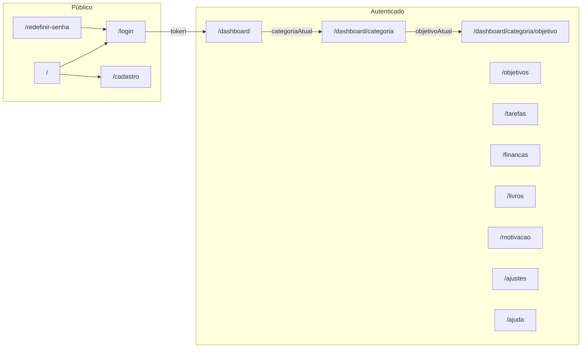

# InEvolving — Levantamento de requisitos (UX/UI & front-end)

Documento gerado a partir do código em `inevolving-web` para apoiar wireframes, redesign e migração de telas sem perda de fluxo.

**Planilha / Jira / Excel:** versão tabular simplificada em [`TABELAS_ENDPOINTS.csv`](./TABELAS_ENDPOINTS.csv) (UTF-8, separador vírgula).

**API base:** `https://api.inevolving.inovasoft.tech` (`src/constants.ts` → `linkApi`)  
**WhatsApp (ajuda):** `linkWpp` em `src/constants.ts`

---

## Índice

1. [Visão do produto](#1-visão-do-produto)
2. [Autenticação e armazenamento local](#2-autenticação-e-armazenamento-local)
3. [Mapa de rotas](#3-mapa-de-rotas)
4. [Fluxo macro](#4-fluxo-macro)
5. [Modelos de dados (interfaces)](#5-modelos-de-dados-interfaces)
6. [Tabelas por tela: componente → endpoint → campos](#6-tabelas-por-tela-componente--endpoint--campos)
7. [Gaps e placeholders no código atual](#7-gaps-e-placeholders-no-código-atual)

---

## 1. Visão do produto

Aplicação web (Next.js) para **gestão de evolução pessoal/profissional**: categorias e objetivos, tarefas (datas, status, kanban, recorrência), finanças mensais, livros, sonhos (motivação) e vision board, dashboard com gráficos e sugestões de IA (“Jarvas”), ajustes de tema/layout e ajuda.

---

## 2. Autenticação e armazenamento local

| Chave | Uso |
|--------|-----|
| `token` | JWT (`BearerToken` no login); header `Authorization: Bearer …` nas rotas `/auth/api/*` |
| `tema` | `1` escuro, `2` claro |
| `tipoMenuDesk` | `1` menu lateral expandido, `2` topo compacto + overlays |
| `categoriaAtual` | JSON da categoria selecionada no dashboard |
| `objetivoAtual` | JSON do objetivo (versão “Objective” com métricas) para análises |
| `email` | Opcional; pré-cadastro vindo da home (`BotaoLogin` tipo 2) |

**401:** redirecionamento comum para `/login` + `alert` informativo.

---

## 3. Mapa de rotas

| Rota | Descrição |
|------|-----------|
| `/` | Landing (desktop: login + registro; mobile: animação + “Começar” → `/login`) |
| `/login` | Login |
| `/cadastro` | Cadastro |
| `/redefinir-senha?token=` | Nova senha (sem token → `/login`) |
| `/dashboard` | Categorias + vision board + editar categoria |
| `/dashboard/categoria` | Objetivos da categoria (`categoriaAtual`) |
| `/dashboard/categoria/objetivo` | Análises + gráficos + Jarvas (`objetivoAtual`) |
| `/objetivos` | Lista/filtros de objetivos; novo objetivo/categoria |
| `/tarefas` | Tarefas (filtros, lista/kanban, nova, busca por ID) |
| `/financas` | Finanças do mês, salário, transações |
| `/livros` | Livros por status; CRUD |
| `/motivacao` | Sonhos; CRUD; alimenta vision board |
| `/ajustes` | Tema, tipo de menu, popups (parte mock) |
| `/ajuda` | Link WhatsApp |
| `/desculpa` | Placeholder “em desenvolvimento” |

**Menu global** (`src/components/Menu/index.tsx`): links para `/dashboard`, `/objetivos`, `/tarefas`, `/financas`, `/livros`, `/motivacao`, `/ajustes`, `/ajuda`; título/logo → `/`.

---

## 4. Fluxo macro

---

## 5. Modelos de dados (interfaces)

**`ResponseDashboard`** (`ResponseDashboard.tsx`): `idUser`, `categoryDTOList: Category[]`

**`Category`** (`Category.tsx`): `id`, `categoryName`, `categoryDescription`, `objectives: Objective[]`

**`Objective`** (`Objective.tsx`): `id`, `nameObjective`, `descriptionObjective`, `statusObjective`, `completionDate`, `idUser`, `totNumberTasks`, `numberTasksToDo`, `numberTasksDone`, `numberTasksInProgress`, `numberTasksOverdue`, `numberTasksCancelled`, percentuais correspondentes

**`Objetivo`** (`Objetivo.tsx`): `id`, `nameObjective`, `descriptionObjective`, `statusObjective`, `completionDate`, `idUser`

**`Tarefa`** / **`Tarefa_Modulo_Tarefas`**: `id`, `nameTask`, `descriptionTask`, `status`, `dateTask`, `idObjective`, `idUser`, `blockedByObjective`, `cancellationReason` (+ campos opcionais em `Tarefa.tsx`)

**`ResponseFinancas`**: `idUser`, `wage`, `totalBalance`, `availableCostOfLivingBalance`, `balanceAvailableToInvest`, `extraBalanceAdded`, `transactionsCostOfLiving[]`, `transactionsInvestment[]`, `transactionsExtraAdded[]`

**`Transacao`**: `id`, `date`, `description`, `value`, `type`

**`Livro`**: `id`, `title`, `author`, `theme`, `status`, `coverImage`, `idUser`

**`Sonho`**: `id`, `name`, `description`, `urlImage`, `idUser`

**Status objetivo (UI):** `TODO` → “Em execução”; `DONE` → “Concluído”

---

## 6. Tabelas por tela: componente → endpoint → campos

Legenda das colunas:

- **Tela:** rota ou módulo
- **Componente / origem:** arquivo principal no código
- **Método + endpoint:** path relativo a `linkApi` (exceto onde indicado URL absoluta)
- **Payload / query / exibição:** o que enviar ou o que mostrar

### 6.1 Autenticação (público)

| Tela | Componente / origem | Método | Endpoint | Payload / query / exibição | Observações |
|------|----------------------|--------|----------|----------------------------|-------------|
| `/login` | `CardInputLogin` | POST | `/api/authentication/login` | Body: `email`, `password` | Sucesso: `localStorage.token` = `BearerToken`; redirect `/dashboard` |
| `/login` | `CardInputLogin` | — | — | Popup `ConfirmeEmail` | Se API retorna `message` = confirmação de e-mail pendente |
| `/login` | `EsqueciSenha` | POST | `/api/authentication/forgot` | Body: `userEmail` | Popup a partir de “Esqueci minha senha” |
| `/cadastro` | `CardInputCadastro` | POST | `/api/authentication/register` | Body: `email`, `password` | Validação cliente: senha = confirmar senha |
| `/cadastro` | `CardInputCadastro` | — | — | Popup `ObrigadoPorSeCadastrar` | Pós-sucesso |
| `/redefinir-senha` | `redefinir-senha/page.tsx` | PUT | `https://api.inevolving.inovasoft.tech/api/authentication/forgot/update` | Body: `idToken` (query `token`), `newPassword` | UI: nova senha + confirmar; sem token → `/login` |

### 6.2 Dashboard

| Tela | Componente / origem | Método | Endpoint | Payload / query / exibição | Observações |
|------|----------------------|--------|----------|----------------------------|-------------|
| `/dashboard` | `dashboard/page.tsx` | GET | `/auth/api/dashboard/categories` | Header: Bearer | Resposta: `ResponseDashboard`; lista categorias |
| `/dashboard` | `dashboard/page.tsx` | GET | `/auth/api/motivation/dreams/visionbord/generate` | Header: Bearer | Resposta: `urlVisionBord`; se `"No dreams were found"` não mostra preview |
| `/dashboard` | `dashboard/page.tsx` | — | — | Exibe: imagem vision board, botão overlay, cards por `categoryName` | Empty: mensagem para criar categoria em Objetivos |
| `/dashboard` | `BotaoDashVerDatalhesCategoria` | — | — | Grava `categoriaAtual` no `localStorage` | Navegação para `/dashboard/categoria` |
| `/dashboard` | `EditarCategoria` | (ver §6.10) | | | Abre ao clicar “Editar” na categoria |

### 6.3 Dashboard → Categoria → Objetivo

| Tela | Componente / origem | Método | Endpoint | Payload / query / exibição | Observações |
|------|----------------------|--------|----------|----------------------------|-------------|
| `/dashboard/categoria` | `dashboard/categoria/page.tsx` | GET | `/auth/api/dashboard/category/objectives/{categoria.id}` | Header: Bearer | Lê `categoriaAtual` do `localStorage` |
| `/dashboard/categoria` | `dashboard/categoria/page.tsx` | — | — | Exibe: `categoryName`, `categoryDescription`, cards de objetivos | Click card: grava `objetivoAtual` → `/dashboard/categoria/objetivo` |
| `/dashboard/categoria` | `dashboard/categoria/page.tsx` | — | — | Link “Editar” em objetivo | Atual: href `/desculpa` (placeholder) |
| `/dashboard/categoria/objetivo` | `dashboard/categoria/objetivo/page.tsx` | — | — | Exibe: `nameObjective`, `descriptionObjective`, `totNumberTasks` | Dados de `localStorage.objetivoAtual` |
| `/dashboard/categoria/objetivo` | `GraficoMotivosTarefas` | GET | `/auth/api/dashboard/cancellation-reason/{idObjective}?idObjective=` | Query: id do objetivo | Gráfico de motivos de cancelamento |
| `/dashboard/categoria/objetivo` | `Jarvas` | GET | `/auth/api/user/neurokeys` | Header: Bearer | Exibe saldo NeuroKeys |
| `/dashboard/categoria/objetivo` | `Jarvas` | DELETE | `/auth/api/user/neurokeys` | Header: Bearer | Antes de consumir análise |
| `/dashboard/categoria/objetivo` | `Jarvas` | POST | `/auth/api/dashboard/ia` | Body: objeto `Objective` completo (todos os campos da interface) | Resposta: markdown em `choices[0].message.content` |

### 6.4 Objetivos

| Tela | Componente / origem | Método | Endpoint | Payload / query / exibição | Observações |
|------|----------------------|--------|----------|----------------------------|-------------|
| `/objetivos` | `objetivos/page.tsx` | GET | `/auth/api/objectives/user` | Header: Bearer | Filtro “Todos” |
| `/objetivos` | `objetivos/page.tsx` | GET | `/auth/api/objectives/status/todo/user` | Header: Bearer | “Em progresso” |
| `/objetivos` | `objetivos/page.tsx` | GET | `/auth/api/objectives/status/done/user` | Header: Bearer | “Concluídos” |
| `/objetivos` | `objetivos/page.tsx` | — | — | Exibe: cards `nameObjective`, status traduzido | Click → `EditarObjetivo` |
| `/objetivos` | `AdicionarNovoObjetivo` | POST | `/auth/api/objectives` | Body: `nameObjective`, `descriptionObjective` | |
| `/objetivos` | `AdicionarNovaCategoria` | POST | `/auth/api/categories` | Body: `categoryName`, `categoryDescription` | Criação simples |
| `/objetivos` | `AdicionarNovaCategoria` | POST | `/auth/api/categories/objective` | Body: `idCategory`, `idObjective` | Por objetivo selecionado na lista |
| `/objetivos` | `AdicionarNovaCategoria` | GET | `/auth/api/objectives/user` | Header: Bearer | Lista para vincular à nova categoria |
| `/objetivos` | `EditarObjetivo` | PUT | `/auth/api/objectives/{id}` | Body: `nameObjective`, `descriptionObjective` | |
| `/objetivos` | `EditarObjetivo` | PATCH | `/auth/api/objectives/{id}/{data}` | Path: data `YYYY-MM-DD` | Marcar concluído |
| `/objetivos` | `EditarObjetivo` | DELETE | `/auth/api/objectives/{id}` | Header: Bearer | Remover |
| `/objetivos` | `VerListaDeTarefas` | GET | `/auth/api/tasks/objective/{objetivoId}` | Header: Bearer | Lista tarefas do objetivo |

### 6.5 Tarefas

| Tela | Componente / origem | Método | Endpoint | Payload / query / exibição | Observações |
|------|----------------------|--------|----------|----------------------------|-------------|
| `/tarefas` | `tarefas/page.tsx` | GET | `/auth/api/tasks/{YYYY-MM-DD}` | Header: Bearer | Tarefas do dia / data selecionada |
| `/tarefas` | `tarefas/page.tsx` | GET | `/auth/api/tasks/status/todo/{data}` | | Filtro status no dia |
| `/tarefas` | `tarefas/page.tsx` | GET | `/auth/api/tasks/status/progress/{data}` | | |
| `/tarefas` | `tarefas/page.tsx` | GET | `/auth/api/tasks/status/done/{data}` | | |
| `/tarefas` | `tarefas/page.tsx` | GET | `/auth/api/tasks/status/canceled/{data}` | | |
| `/tarefas` | `tarefas/page.tsx` | GET | `/auth/api/tasks/late` | | Atrasadas |
| `/tarefas` | `tarefas/page.tsx` | GET | `/auth/api/objectives/status/todo/user` | | Select de objetivo ao criar tarefa |
| `/tarefas` | `tarefas/page.tsx` | POST | `/auth/api/tasks` | Body: `nameTask`, `descriptionTask`, `dateTask`, `idObjective` | |
| `/tarefas` | `tarefas/page.tsx` | POST | `/auth/api/tasks/repeat/{id}/{dateTask}/{dataFim}` | Body: `monday`…`sunday` (boolean) | Após criar tarefa se recorrente |
| `/tarefas` | `tarefas/page.tsx` | GET | `/auth/api/tasks/task/{id}` | | Busca por ID |
| `/tarefas` | `editarTarefa` | GET/PUT/PATCH/POST | múltiplos (ver abaixo) | | Edição completa |

**`editarTarefa` — chamadas API (referência):**

| Método | Endpoint | Uso típico |
|--------|----------|------------|
| GET | `/auth/api/tasks/{id}` | Carregar tarefa |
| GET | `/auth/api/objectives/status/todo/user` | Objetivos para reassociação |
| GET | `/auth/api/objectives/{idObjective}` | Dados do objetivo |
| PUT | `/auth/api/tasks/{id}` | Atualizar tarefa |
| POST | `/auth/api/tasks/repeat/{id}/{dateTask}` | Configurar repetição |
| POST | `/auth/api/tasks/repeat/{id}/{data}` | Variação de data final |
| PATCH | `/auth/api/tasks/status/todo/{id}` | Status TODO |
| PATCH | `/auth/api/tasks/status/progress/{id}` | Em progresso |
| PATCH | `/auth/api/tasks/status/done/{id}` | Concluída |
| PATCH | `/auth/api/tasks/status/late/{id}` | Atrasada |
| POST | `/auth/api/tasks/status/canceled` | Cancelar (com motivo) |
| PATCH | `/auth/api/tasks/date/{id}/{YYYY-MM-DD}` | Mudar data |
| GET | `/auth/api/dashboard/cancellation-reason/{idObjective}?idObjective=` | Motivos para cancelamento |

| Tela | Componente / origem | Método | Endpoint | Payload / query / exibição | Observações |
|------|----------------------|--------|----------|----------------------------|-------------|
| `/tarefas` | `menuStatusTarefa` | PATCH | `/auth/api/tasks/status/todo/{id}` | | Menu rápido de status |
| `/tarefas` | `menuStatusTarefa` | PATCH | `/auth/api/tasks/status/progress/{id}` | | |
| `/tarefas` | `menuStatusTarefa` | PATCH | `/auth/api/tasks/status/done/{id}` | | |
| `/tarefas` | `menuStatusTarefa` | PATCH | `/auth/api/tasks/status/late/{id}` | | |

### 6.6 Finanças

| Tela | Componente / origem | Método | Endpoint | Payload / query / exibição | Observações |
|------|----------------------|--------|----------|----------------------------|-------------|
| `/financas` | `financas/page.tsx` | GET | `/auth/api/finance/{primeiroDiaMes}/{primeiroDiaMesSeguinte}` | Path: `YYYY-M-D` | `ResponseFinancas` |
| `/financas` | `financas/page.tsx` | DELETE | `/auth/api/finance/transaction/{id}` | Header: Bearer | Excluir transação |
| `/financas` | `financas/page.tsx` | POST | `/auth/api/finance/transaction/cost_of_living` | Body: valor, descrição, data (conforme UI) | Custo de vida |
| `/financas` | `financas/page.tsx` | POST | `/auth/api/finance/transaction/investment` | | Investimento |
| `/financas` | `financas/page.tsx` | POST | `/auth/api/finance/transaction/extra_contribution` | | Entrada extra |
| `/financas` | `financas/page.tsx` | PUT/PATCH | `/auth/api/finance/wage` | Body: salário | Configurar `wage` |
| `/financas` | `financas/page.tsx` | — | — | Exibe: saldos, listas `transactions*`, mês/ano, modais informativos | `wage === 0` → fluxo primeiro salário |

### 6.7 Livros

| Tela | Componente / origem | Método | Endpoint | Payload / query / exibição | Observações |
|------|----------------------|--------|----------|----------------------------|-------------|
| `/livros` | `livros/page.tsx` | POST | `/auth/api/books` | Body: `title`, `author`, `theme`, `coverImage` | Novo livro |
| `/livros` | `livros/page.tsx` | GET | `/auth/api/books/status/todo` | | Pendentes |
| `/livros` | `livros/page.tsx` | GET | `/auth/api/books/status/progress` | | Lendo |
| `/livros` | `livros/page.tsx` | GET | `/auth/api/books/status/completed` | | Concluídos |
| `/livros` | `editarLivro` | PUT | `/auth/api/books/{id}` | Body: campos do livro | Atualizar |
| `/livros` | `editarLivro` | PATCH | `/auth/api/books/status/todo/{id}` | | |
| `/livros` | `editarLivro` | PATCH | `/auth/api/books/status/progress/{id}` | | |
| `/livros` | `editarLivro` | PATCH | `/auth/api/books/status/completed/{id}` | | |

### 6.8 Motivação (sonhos)

| Tela | Componente / origem | Método | Endpoint | Payload / query / exibição | Observações |
|------|----------------------|--------|----------|----------------------------|-------------|
| `/motivacao` | `motivacao/page.tsx` | POST | `/auth/api/motivation/dreams` | Body: `name`, `description`, `urlImage` | Novo sonho |
| `/motivacao` | `motivacao/page.tsx` | GET | `/auth/api/motivation/dreams/user` | | Lista sonhos |
| `/motivacao` | `motivacao/page.tsx` | — | — | Exibe: contagem, cards com imagem e nome | |
| `/motivacao` | `editarSonho` | PUT | `/auth/api/motivation/dreams/{id}` | | Atualizar |
| `/motivacao` | `editarSonho` | POST | `/auth/api/motivation/dreams` | | Criação alternativa no fluxo do popup |

### 6.9 Menu resumo (calendário)

| Tela | Componente / origem | Método | Endpoint | Payload / query / exibição | Observações |
|------|----------------------|--------|----------|----------------------------|-------------|
| (overlay / sidebar) | `MenuResumo` | GET | `/auth/api/tasks/{YYYY-MM-DD}` | Header: Bearer | Tarefas do dia selecionado no calendário |
| (overlay / sidebar) | `MenuResumo` | — | — | Abre `EditarTarefa` ao selecionar tarefa | |

### 6.10 Categorias (popup edição)

| Tela | Componente / origem | Método | Endpoint | Payload / query / exibição | Observações |
|------|----------------------|--------|----------|----------------------------|-------------|
| `/dashboard` (popup) | `editarCategoria` | GET | `/auth/api/dashboard/category/objectives/{id}` | | Sincronizar dados |
| `/dashboard` (popup) | `editarCategoria` | PUT | `/auth/api/categories/{id}` | Body: nome/descrição categoria | |
| `/dashboard` (popup) | `editarCategoria` | POST | `/auth/api/categories/objective` | Body: `idCategory`, `idObjective` | Vincular objetivo |
| `/dashboard` (popup) | `editarCategoria` | DELETE | URL com `idCategoria` e `idObjetivo` no path | | Desvincular (path composto no código) |
| `/dashboard` (popup) | `editarCategoria` | DELETE | `/auth/api/categories/{id}` | | Excluir categoria |
| `/dashboard` (popup) | `editarCategoria` | GET | `/auth/api/objectives/user` | | Lista para vínculos |

### 6.11 Ajustes e ajuda

| Tela | Componente / origem | Método | Endpoint | Payload / query / exibição | Observações |
|------|----------------------|--------|----------|----------------------------|-------------|
| `/ajustes` | `ajustes/page.tsx` | — | `localStorage` | `tema`, `tipoMenuDesk` | Sem API; reload após mudança |
| `/ajustes` | `AlterarTipoDoMenuPopUp` | — | `localStorage.tipoMenuDesk` | Valores `1` ou `2` | |
| `/ajustes` | `AlterarInformacoesDoUsuario` | — | — | Campos nome/e-mail | **Mock** no código; API comentada |
| `/ajustes` | `EsqueciSenha` | POST | `/api/authentication/forgot` | `userEmail` | Reuso para “alterar senha” |
| `/ajustes` | `VerListaDeAmigos` | — | — | E-mail amigo, lista mock | **Sem integração API** |
| `/ajustes` | `RenovacaoPopUp` | — | — | Data exibida mock | **Sem integração API** |
| `/ajuda` | `ajuda/page.tsx` | — | `linkWpp` | Abre WhatsApp em nova aba | |

---

## 7. Gaps e placeholders no código atual

- **`/desculpa`:** usado como “em desenvolvimento” no editar objetivo a partir de `/dashboard/categoria`.
- **Ajustes:** perfil, amigos e renovação não chamam backend nas implementações atuais.
- **Login:** link “Cadastre-se” em `CardInputLogin` aponta para `/` em vez de `/cadastro` (vale corrigir no redesign).
- **Home → cadastro:** `CardRegistro` não envia `value` ao `BotaoLogin`; `localStorage.email` pode ficar vazio.

---

## Referência rápida de arquivos

| Área | Pastas / arquivos principais |
|------|------------------------------|
| Rotas | `src/app/**/page.tsx` |
| Auth | `CardInputLogin`, `CardInputCadastro`, `PopUp/esqueciSenha`, `app/redefinir-senha` |
| Menu | `components/Menu`, `components/MenuResumo` |
| Popups | `components/PopUp/**` |
| Tipos | `components/interfaces/*.tsx` |
| API base | `src/constants.ts` |

---

*Última atualização: alinhado ao repositório na data de geração deste documento.*
